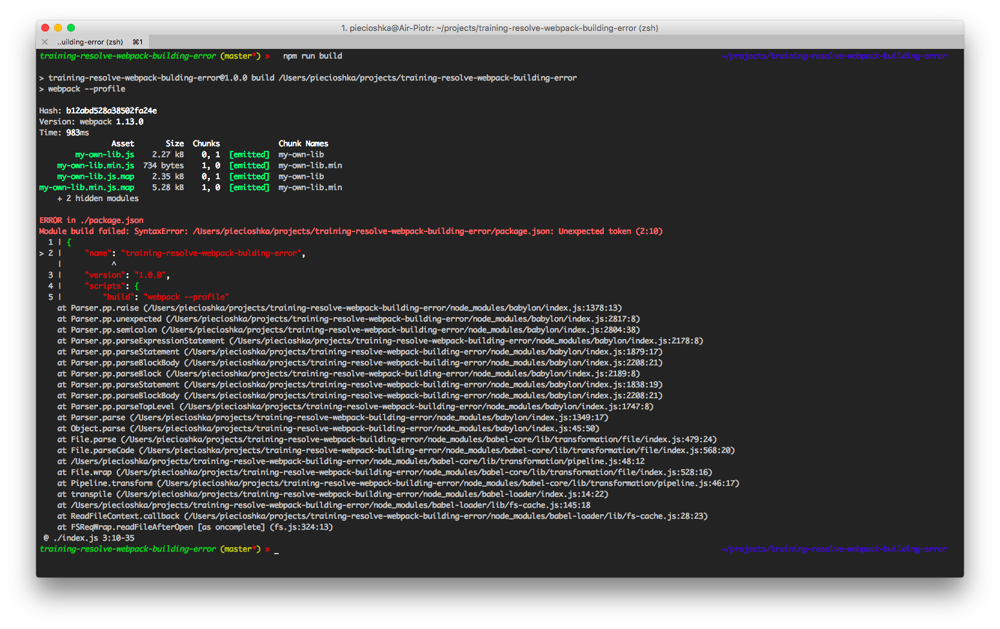
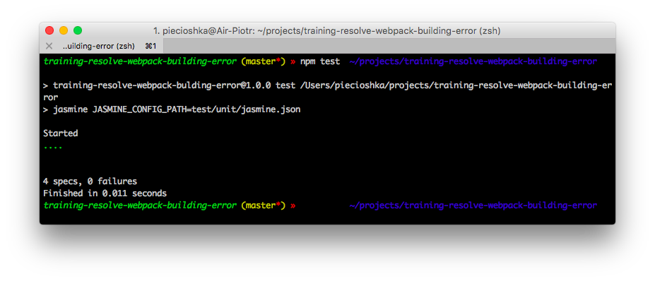
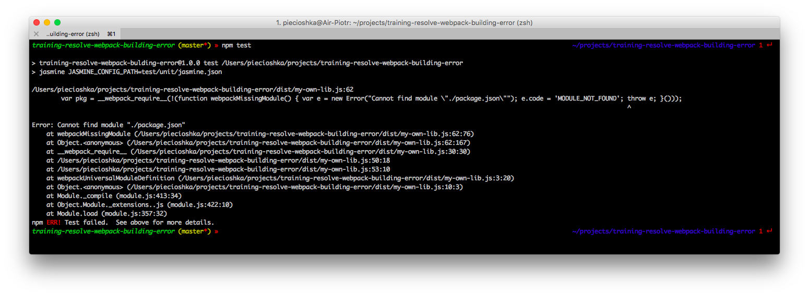

# training-resolve-webpack-building-error

> Zadanie, aby poprawić swoje umiejętności korzystania z narzędzi `webpack`, `babel`.

## Zadanie

### Cel

proces budowania zakończony sukcesem, bez błędów w konsoli

### Treść

Zadanie polega na tym, aby rozwiązać problem, który pokazuje się konsoli,
podczas budowania aplikacji za pomocą polecania `npm run build`.

### Jak sprawdzić rozwiązanie?

Jeśli poprawiłeś aplikację i jesteś przekonany co do rozwiązania
to aby sprawdzić, czy zadanie rozwiązałeś poprawnie skorzystaj
z polecenia `npm test`.

W przypadku nie powodzenia otrzymać komunikat podobny do takiego

